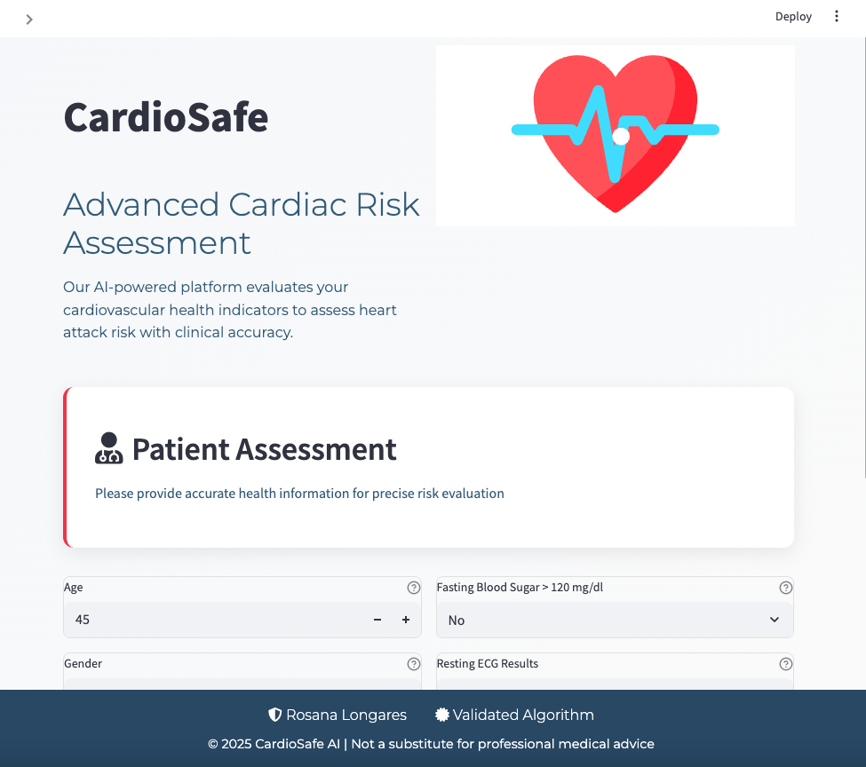
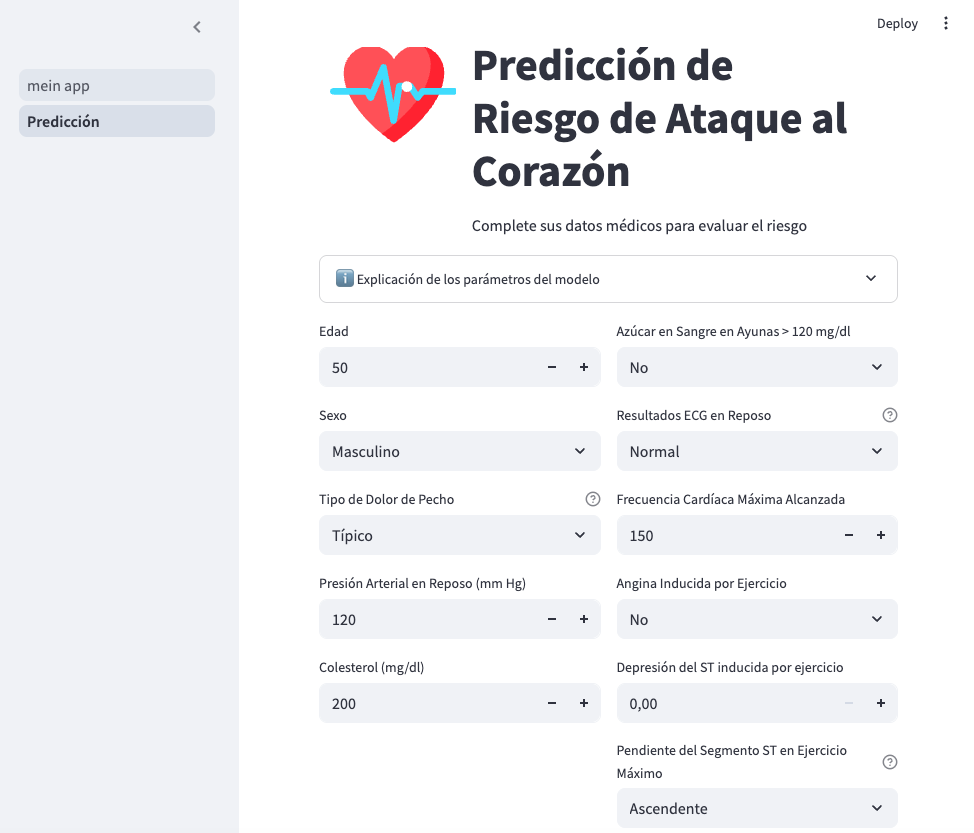
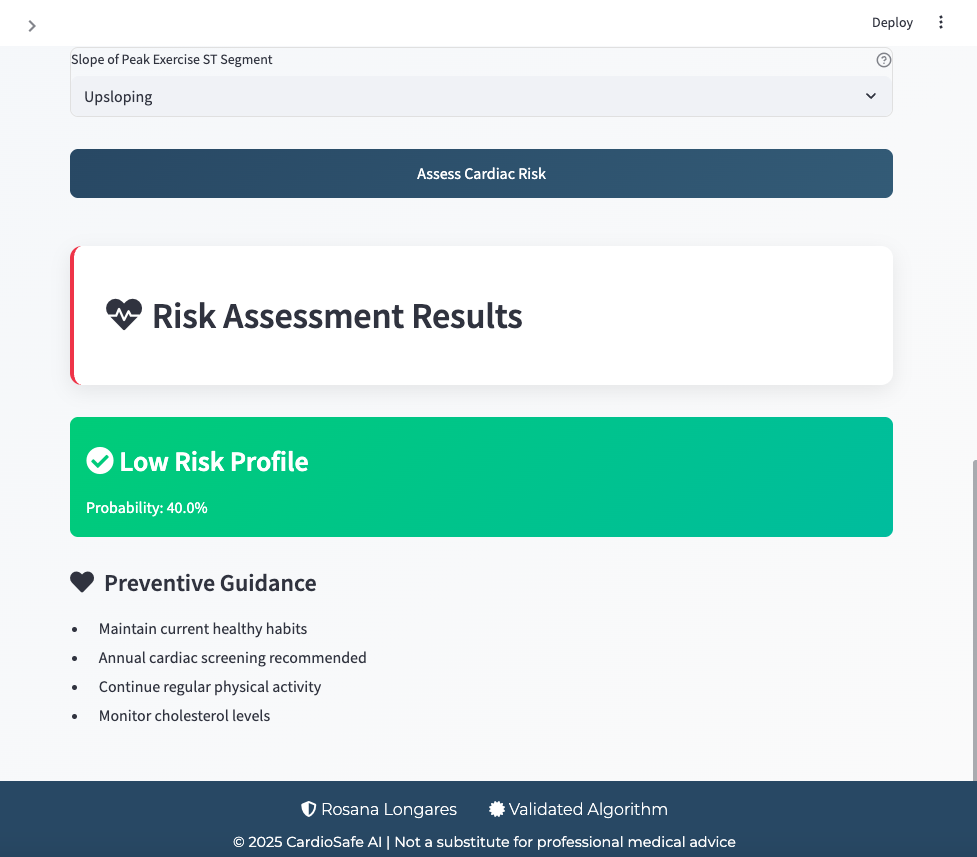

❤️ CardioSafe: Predicción del Riesgo de Infarto con IA
📱 Capturas de Pantalla

    
🏥 Información Clínica al Alcance
CardioSafe utiliza machine learning para evaluar 11 parámetros de salud críticos, proporcionando una estratificación instantánea del riesgo de infarto con 89.5% de precisión. Diseñado para:

Pacientes: Conciencia proactiva de su salud

Médicos: Evaluación preliminar rápida

Investigadores: Demostración de interpretabilidad del modelo

✨ Características Principales
Característica	Beneficio
🎚️ Entrada Multiparámetro	Evaluación integral del riesgo (PA, colesterol, ECG, etc.)
🚦 Indicador Visual de Riesgo	Alertas codificadas por color con animación de pulso para alto riesgo
📋 Guía Accionable	Recomendaciones clínicas personalizadas
🖥️ Diseño Responsivo	Optimizado para escritorio y móvil
👀 Recorrido Visual
Recolección de Datos: Los usuarios ingresan sus métricas de salud (edad, presión arterial, niveles de colesterol, etc.)

Análisis Instantáneo: Nuestro modelo KNN procesa los datos en tiempo real

Retroalimentación Visual: Indicador de riesgo codificado por color con elementos animados

Siguientes Pasos: Recomendaciones claras según el nivel de riesgo

Stack Principal:

scikit-learn 1.4.0 (Clasificador KNN)

streamlit 1.29.0 (Interfaz web)

Pillow 10.1.0 (Procesamiento de imágenes)

streamlit-lottie 0.0.4 (Animaciones)

🚀 Guía de Despliegue
Instalación Local:

bash
git clone https://github.com/RosanaNicklas/attack
cd Heartattack
pip install -r requirements.txt
streamlit run mein_app.py
Despliegue en la Nube:
Próximamente

📊 Métricas del Modelo
Métrica	Puntuación
Precisión	89.5%
Exactitud	91.2%
Sensibilidad	87.8%
AUC-ROC	0.93
*Entrenado con el dataset UCI Heart Disease (n=303)*

📜 Consideraciones Éticas
❗ Limitaciones Importantes:

No está aprobado por la FDA

No debe guiar decisiones de tratamiento

Sesgo poblacional en los datos de entrenamiento

Requiere validación clínica para uso individual

📬 Contacto
Rosana Longares
rosana8longares@gmail.com

Soporte Técnico:
GitHub Issues

© 2025 CardioSafe AI | Esta herramienta es solo con fines educativos